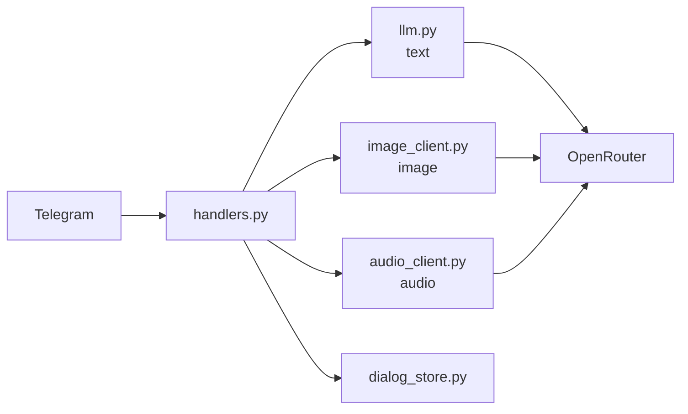

# Техническое видение проекта

Документ описывает минимальный технический проект для проверки идеи из `docs/idea.md`: Telegram-бота с LLM в роли инженера мониторинга ИТ-сети, ориентированного на быстрый запуск MVP без оверинжиниринга.

## 1. Технологии

- Язык: `Python 3.12`.
- Управление зависимостями: `uv`.
- Работа с LLM: `openai` client с провайдером `OpenRouter` (через `base_url` и API-ключ).
- Мультимодальность: анализ текста и изображений, а также обработка аудио.
- Аудио: нативная поддержка OpenRouter через `input_audio` (base64), без использования Whisper.
- Интеграция с Telegram: `aiogram` (режим `polling`).
- Локальный запуск в контейнере: `Docker` (+ при необходимости `docker compose`).
- Локальная сборка/запуск: `Makefile` (сценарии без Docker и с Docker).

## 2. Принцип разработки

- Базовый принцип: `KISS` — только минимально необходимая функциональность для проверки гипотезы.
- Архитектурный стиль: функциональный подход (без ООП).
- Код организован простыми модулями по ответственности: Telegram, LLM, конфиг, память диалога, запуск.
- Внешние вызовы асинхронные (`asyncio` + `aiogram` + async-клиент LLM).
- Конфигурация через переменные окружения (`.env`), без захардкоженных секретов.
- Хранение контекста на старте — in-memory (без БД), с допустимой потерей данных при перезапуске.

## 3. Структура проекта

- `src/main.py` — точка входа, запуск бота в режиме polling.
- `src/config.py` — загрузка и валидация переменных окружения.
- `src/handlers.py` — обработчики входящих сообщений Telegram.
- `src/llm.py` — текстовый анализ инцидентов через LLM.
- `src/image_client.py` — клиент анализа изображений (по умолчанию OpenRouter).
- `src/audio_client.py` — клиент обработки аудио (по умолчанию OpenRouter, `input_audio` base64).
- `src/prompts.py` — системные промпты под разные задачи (текст/изображение/аудио).
- `src/dialog_store.py` — in-memory хранение истории сообщений по `chat_id`.
- `tests/` — минимальные smoke-тесты.
- Корневые служебные файлы: `Makefile`, `Dockerfile`, `.env.example`, `pyproject.toml`.

## 4. Архитектура проекта

- Архитектура линейная и минимальная: `Telegram (aiogram polling) -> handlers.py -> text/image/audio client -> OpenRouter -> ответ в Telegram`.
- `main.py` выполняет только инициализацию зависимостей и запуск polling.
- `handlers.py` управляет маршрутизацией по типу входа (текст/фото/аудио), получает контекст, вызывает соответствующий клиент, отправляет ответ.
- `dialog_store.py` хранит и обновляет историю переписки в памяти для каждого `chat_id`.
- Клиенты (`llm.py`, `image_client.py`, `audio_client.py`) изолируют работу с провайдером и являются точками расширения для подмены реализации.

## 5. Модель данных

- Основное хранилище контекста: `chat_histories: dict[int, list[dict[str, str]]]`.
- Ключ в хранилище: `chat_id` из Telegram.
- Элемент истории: словарь `{ "role": "...", "content": "..." }`, совместимый с chat-completions API.
- Для мультимодальных входов хранятся метаданные сообщения: `message_type` (`text` | `image` | `audio`) и `source_file_id` (опционально).
- Системное поведение ассистента задаётся отдельными промптами под задачи: `SYSTEM_PROMPT_TEXT`, `SYSTEM_PROMPT_IMAGE`, `SYSTEM_PROMPT_AUDIO`.
- Конфигурация моделей хранится отдельно по типам задач: `LLM_TEXT_MODEL`, `LLM_IMAGE_MODEL`, `LLM_AUDIO_MODEL`.

## 6. Работа с LLM

- Разные задачи обрабатываются разными клиентами: `llm.py` (текст), `image_client.py` (фото), `audio_client.py` (аудио).
- Для каждой задачи используется свой системный промпт и своя модель.
- Запросы формируются с учетом типа входа: текстовый контекст, изображение, аудио.
- Аудио передаётся в OpenRouter нативно через `input_audio` base64 (без Whisper).
- `SYSTEM_PROMPT_TEXT`, `SYSTEM_PROMPT_IMAGE`, `SYSTEM_PROMPT_AUDIO` являются обязательными (fail fast на старте).
- Клиенты конфигурируются из `.env` через `LLM_BASE_URL`, `LLM_API_KEY`, `LLM_PROVIDER` и соответствующие model-переменные.
- Провайдер выбирается через `LLM_PROVIDER`; значение по умолчанию — `openrouter`.
- Поддерживаются провайдеры с OpenAI-compatible API; клиенты являются точками расширения и допускают подмену реализации.
- При ошибке LLM API пользователю возвращается короткое сообщение о временной недоступности, техническая причина фиксируется в логах.

## 7. Сценарии работы

- `startup`: при старте валидируются обязательные переменные окружения, включая промпты и модели для текста/фото/аудио; при отсутствии значений бот не запускается.
- `start`: пользователь вызывает `/start`, бот отправляет приветствие и краткую инструкцию по использованию.
- `chat-text`: пользователь описывает аварийное событие текстом, бот выполняет первичный анализ и предлагает рекомендации.
- `chat-image`: пользователь отправляет фото аварийного события или неисправного оборудования, бот оценивает ситуацию и предлагает действия.
- `chat-audio`: пользователь отправляет голосовое сообщение, бот выполняет транскрипцию/интерпретацию и выдает рекомендации.
- `decision`: в ответе бот выделяет наиболее быстрый и наиболее эффективный способ устранения (с учетом влияния на оборудование и клиентов).
- `reset`: пользователь вызывает `/reset`, бот очищает историю текущего чата (начало нового инцидента).
- `error`: при ошибке LLM API или сети бот отвечает коротким fallback-сообщением о временной недоступности.

## 8. Подход к конфигурированию

- Единый источник конфигурации для MVP: `.env`.
- В репозитории хранится только `.env.example` без секретов.
- Загрузка и первичная валидация конфига выполняются в `src/config.py` на старте приложения.
- Подход `fail fast`: при отсутствии обязательных значений приложение завершается с понятной ошибкой.
- Обязательные переменные: `TELEGRAM_BOT_TOKEN`, `LLM_PROVIDER`, `LLM_BASE_URL`, `LLM_API_KEY`, `LLM_TEXT_MODEL`, `LLM_IMAGE_MODEL`, `LLM_AUDIO_MODEL`, `SYSTEM_PROMPT_TEXT`, `SYSTEM_PROMPT_IMAGE`, `SYSTEM_PROMPT_AUDIO`.
- Для `LLM_PROVIDER` используется значение по умолчанию `openrouter`, если явно не задано и поддержан дефолт в конфиге.
- Для MVP не используются сложные многоуровневые конфиги, профили окружений и внешние конфиг-сервисы.

## 9. Подход к логгированию

- Для MVP используется стандартный модуль `logging` из Python без дополнительных библиотек.
- Логи пишутся в `stdout`, чтобы одинаково работать в локальном запуске и в Docker.
- Формат записи: время, уровень, модуль, сообщение.
- Уровень `INFO`: запуск/остановка приложения, обработка команд, успешные ответы.
- Уровень `WARNING`: временные сбои внешних вызовов.
- Уровень `ERROR`: ошибки Telegram API, LLM API и необработанные исключения.
- В логах не допускаются секреты (`TELEGRAM_BOT_TOKEN`, `LLM_API_KEY`) и полный текст пользовательских сообщений.

## 10. Подход к сборке и деплою

- Локальный запуск без Docker: `make run`.
- Локальный запуск с Docker: `make run-docker` / `make docker-build` / `make docker-down`.
- Конфигурация в обоих режимах берётся из `.env`.
- Облачный деплой: **Railway** — платформа с поддержкой Docker-контейнеров, деплой через GitHub-интеграцию или Railway CLI.
- Секреты (`TELEGRAM_BOT_TOKEN`, `LLM_API_KEY` и др.) задаются в переменных окружения Railway (не в репозитории).
- CI/CD: при пуше в `main` Railway автоматически пересобирает и перезапускает контейнер.
- `Procfile` или Railway-совместимый `Dockerfile` используется как точка входа при облачном деплое.
