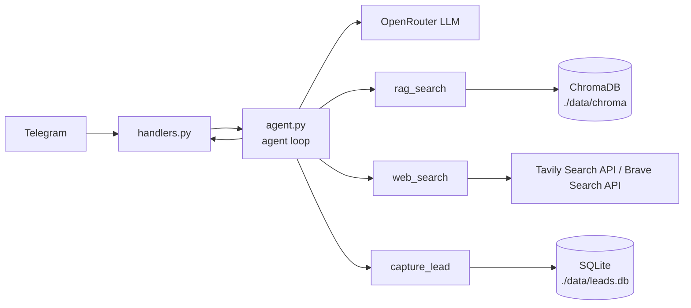

# Техническое видение проекта

Документ описывает минимальный технический проект для проверки идеи из `docs/idea.md`: Telegram-бота в роли ИИ-агента-консультанта, ориентированного на быстрый запуск MVP без оверинжиниринга.

## 1. Технологии

| Область | Технология | Назначение |
| --- | --- | --- |
| Язык | `Python 3.12` | Основной язык проекта |
| Зависимости | `uv` | Установка и запуск |
| Telegram | `aiogram` (`polling`) | Входной канал и обработка сообщений |
| LLM + tools | `openai` SDK | Единый клиент для LLM и tool calling |
| Agent loop | `openai` SDK tool calling | Явный и читаемый цикл вызова инструментов |
| Embeddings | `text-embedding-3-small` (через `.env`) | Векторизация документов и запросов; конкретная модель задаётся переменной `EMBEDDING_MODEL` |
| Векторная БД | `chromadb` (`./data/chroma`) | Поиск по документам компании (RAG) |
| PDF-парсинг | `pymupdf4llm` | Извлечение текста из PDF |
| Веб-поиск | `tavily-python` / `Brave Search API` | Проверка актуальных фактов из интернета |
| Лид-система | `sqlite3` (`./data/leads.db`) | Фиксация заявок на консультацию |
| Мониторинг (опц.) | `langsmith` | Трейсинг цепочки ответа агента |
| Контейнеризация | `Docker` / `docker compose` | Локальный и облачный запуск |
| Автоматизация | `Makefile` | Единые команды запуска и обслуживания |

## 2. Принцип разработки

- Базовый принцип: `KISS` — только минимально необходимая функциональность для проверки гипотезы.
- Архитектурный стиль: функциональный подход (без ООП).
- Без `LangChain` и тяжелых AI-фреймворков: только `openai` SDK и минимальные библиотеки по задаче.
- Агентный цикл явный и читаемый: шаги выбора инструмента и финального ответа легко проследить в коде.
- Код организован простыми модулями по ответственности: Telegram, агент, инструменты, конфиг, запуск.
- Внешние вызовы асинхронные (`asyncio` + `aiogram` + async-клиент LLM) и единообразные по стилю.
- Конфигурация через переменные окружения (`.env`), без захардкоженных секретов.
- Постоянные данные хранятся в `./data`, чтобы не теряться после перезапуска контейнера.

## 3. Структура проекта

- `src/main.py` — точка входа, запуск бота в режиме polling.
- `src/config.py` — загрузка и валидация переменных окружения.
- `src/handlers.py` — обработчики входящих сообщений Telegram.
- `src/agent.py` — агентный цикл консультанта (принятие решения: ответить сразу или вызвать инструмент).
- `src/tools/rag_search.py` — поиск по документам компании (портфолио/услуги/программы курсов).
- `src/tools/web_search.py` — проверка актуальных фактов из интернета.
- `src/tools/capture_lead.py` — фиксация лида (имя, контакт, запрос).
- `src/rag/` — индексация PDF и работа с векторным хранилищем.
- `data/SYSTEM_PROMPT.txt` — единый системный промпт агента-консультанта.
- `tests/` — минимальные smoke-тесты.
- Корневые служебные файлы: `Makefile`, `Dockerfile`, `.env.example`, `pyproject.toml`.
- `data/` — постоянные данные (`chroma`, `leads.db`).

## 4. Архитектура проекта

- Архитектура минимальная с явным агентным циклом: `Telegram -> handlers.py -> agent loop -> tools/LLM -> ответ в Telegram`.
- `main.py` выполняет только инициализацию зависимостей и запуск polling.
- `handlers.py` принимает сообщение пользователя и передает его в агент.
- `agent.py` решает: ответить сразу или вызвать инструмент (`rag_search`, `web_search`, `capture_lead`) и затем собрать итоговый ответ.
- `rag_search` возвращает факты из внутренних PDF-материалов компании.
- `web_search` используется, когда нужна проверка актуальности или уверенность ответа низкая.
- `capture_lead` сохраняет заявку на консультацию в базе и возвращает подтверждение.

## 5. Модель данных

- Контекст диалога хранится по `chat_id` (минимальный state текущего диалога).
- RAG-индекс: коллекции и чанки документов в `ChromaDB` (`./data/chroma`).
- Источники документов: PDF компании (портфолио, услуги, программы курсов) из папки `data`.
- Лиды хранятся в `SQLite` (`./data/leads.db`): `id`, `created_at`, `name`, `contact`, `request_text`, `source_chat_id`.
- Системный промпт хранится в файле `data/SYSTEM_PROMPT.txt`, в конфиге передается путь до файла.

## 6. Работа с LLM

- LLM используется как управляющее ядро агента и как генератор финального ответа пользователю.
- Агент работает через `openai` SDK tool calling: модель может вызвать `rag_search`, `web_search`, `capture_lead`.
- Эмбеддинги строятся моделью `text-embedding-3-small` через тот же `LLM_BASE_URL` (OpenRouter-compatible endpoint).
- Модель эмбеддингов задаётся в `.env` отдельной переменной (например, `EMBEDDING_MODEL`).
- Системный промпт загружается из файла по пути из `.env` (например, `SYSTEM_PROMPT_PATH=data/SYSTEM_PROMPT.txt`).
- Когда агент не уверен или тема может быть устаревшей, он использует веб-поиск перед финальным ответом.
- Провайдер выбирается через `LLM_PROVIDER`; значение по умолчанию — `openrouter`.
- Поддерживаются провайдеры с OpenAI-compatible API; клиенты являются точками расширения и допускают подмену реализации.
- При ошибке LLM API пользователю возвращается короткое сообщение о временной недоступности, техническая причина фиксируется в логах.

## 7. Сценарии работы

- `startup`: при старте валидируются обязательные переменные окружения, загружается `data/SYSTEM_PROMPT.txt`, открываются `ChromaDB` и `leads.db`; при ошибке бот не запускается.
- `start`: пользователь вызывает `/start`, бот отправляет приветствие и краткую инструкцию по использованию.
- `chat-question`: пользователь задает вопрос о компании/услугах/курсах, агент ищет ответ в базе документов и возвращает краткую консультацию.
- `fact-check`: если вопрос про актуальные условия/рынок/внешние данные, агент дополнительно проверяет факты через веб-поиск.
- `lead-capture`: агент подводит пользователя к заявке, запрашивает имя и контакт, фиксирует лид и подтверждает прием заявки.
- `reset`: пользователь вызывает `/reset`, бот очищает историю текущего чата (начало нового инцидента).
- `error`: при ошибке LLM API или сети бот отвечает коротким fallback-сообщением о временной недоступности.

## 8. Подход к конфигурированию

- Единый источник конфигурации для MVP: `.env`.
- В репозитории хранится только `.env.example` без секретов.
- Загрузка и первичная валидация конфига выполняются в `src/config.py` на старте приложения.
- Подход `fail fast`: при отсутствии обязательных значений приложение завершается с понятной ошибкой.
- Обязательные переменные: `TELEGRAM_BOT_TOKEN`, `LLM_PROVIDER`, `LLM_BASE_URL`, `LLM_API_KEY`, `LLM_MODEL`, `EMBEDDING_MODEL`, `SYSTEM_PROMPT_PATH`, `TAVILY_API_KEY` или `BRAVE_API_KEY`.
- Для лидов и векторной базы используются локальные пути в `./data` (по умолчанию): `LEADS_DB_PATH=./data/leads.db`, `CHROMA_PATH=./data/chroma`.
- Опциональный мониторинг трассировок: `LANGSMITH_ENABLED=false` (по умолчанию отключено).
- Для `LLM_PROVIDER` используется значение по умолчанию `openrouter`, если явно не задано и поддержан дефолт в конфиге.
- Для MVP не используются сложные многоуровневые конфиги, профили окружений и внешние конфиг-сервисы.

## 9. Подход к логгированию

- Для MVP используется стандартный модуль `logging` из Python без дополнительных библиотек.
- Логи пишутся в `stdout`, чтобы одинаково работать в локальном запуске и в Docker.
- Формат записи: время, уровень, модуль, сообщение.
- Уровень `INFO`: запуск/остановка приложения, обработка команд, успешные ответы.
- Уровень `WARNING`: временные сбои внешних вызовов и fallback между инструментами.
- Уровень `ERROR`: ошибки Telegram API, LLM API, Tavily/Brave и необработанные исключения.
- В логах не допускаются секреты (`TELEGRAM_BOT_TOKEN`, `LLM_API_KEY`) и полный текст пользовательских сообщений.
- При включенном `LANGSMITH_ENABLED=true` дополнительно отправляются трассировки агентного цикла.

## 10. Подход к сборке и деплою

- Локальный запуск без Docker: `make run`.
- Локальный запуск с Docker: `make run-docker` / `make docker-build` / `make docker-down`.
- Конфигурация в обоих режимах берётся из `.env`.
- Для Docker используется volume `./data:/app/data`, чтобы `chroma` и `leads.db` сохранялись между перезапусками.
- Облачный деплой: **Railway** — платформа с поддержкой Docker-контейнеров, деплой через GitHub-интеграцию или Railway CLI.
- Секреты (`TELEGRAM_BOT_TOKEN`, `LLM_API_KEY`, `TAVILY_API_KEY`/`BRAVE_API_KEY` и др.) задаются в переменных окружения Railway (не в репозитории).
- CI/CD: при пуше в `main` Railway автоматически пересобирает и перезапускает контейнер.
- `Procfile` или Railway-совместимый `Dockerfile` используется как точка входа при облачном деплое.
